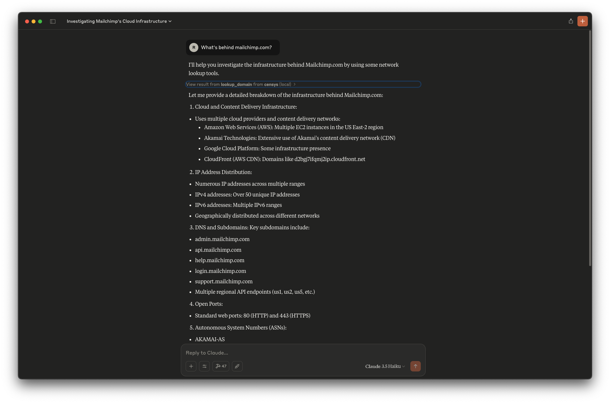

# mcp-censys

> mcp-censys is a conversational MCP server that taps into the Censys Search API for real-time domain, IP, and FQDN reconnaissance. Just ask.

> [!CAUTION]
> This is intended solely as a demonstration and is not production-ready. It is not an officially supported product.

## Overview

mcp-censys turns natural language prompts into targeted Censys queries — surfacing host, DNS, cert, and service information in real-time. It's designed to work with Claude Desktop or any other Model Context Protocol (MCP) client.

Built on the official Censys Python SDK, this lightweight container exposes precise reconnaissance tools through Claude-friendly functions.

## Features

- **Conversational Queries**: Natural language access to Censys intel
- **Domain and IP Lookup**: Get DNS names, ASN, services, and TLS context
- **New FQDN Discovery**: Find recently seen subdomains from DNS and cert data
- **MCP-Compatible Tools**: Use directly from Claude Desktop
- **Dockerized with .env support**: Secure, repeatable usage
- **Lightweight API Client**: Based on Censys Python SDK

## Tools

- **lookup_domain** - Get comprehensive IPs, DNS names, services, and ASN info for a domain (aggregates data across all results)
- **lookup_domain_detailed** - Return a sample of 3 individual host records with services, ASN, geo, and TLS data, along with information about total available records
- **lookup_ip** - Enrich an IP with DNS, ASN, service info, and TLS metadata
- **new_fqdns** - Find recently observed FQDNs for a domain (via DNS and certs)
- **host_services** - List open ports and service banners for a given domain or IP

## Quick Start Guide

### 1. Domain Lookup (`lookup_domain`)

Returns complete information by aggregating all IPs, DNS names, service banners, and ASN info tied to a specific domain. Useful for understanding what infrastructure a domain resolves to.

Example:

```
User: What's behind mailchimp.com?

AI: mailchimp.com resolves to multiple IPs operated by The Rocket Science Group (AS2635). The domain exposes ports 80 and 443 with HTTP services, and reverse DNS shows aliases like smtp.mailchimp.com and us1.admin.mailchimp.com. Several servers respond with the banner 'mailchimp-nginx'.
```

### 2. Detailed Domain Lookup (`lookup_domain_detailed`)

Provides a sample of actual host records (limited to 3) matching a domain query, plus information about how many total records exist.

Example:

```
User: Show me detailed records for mailchimp.com

AI: I found 42 host records for mailchimp.com. Here's a sample of 3:

IP: 205.201.131.98 - Located in Atlanta, GA (The Rocket Science Group)
Services: HTTP/80, HTTPS/443, SMTP/25
OS: Ubuntu 18.04
IP: 205.201.132.24 - Located in Atlanta, GA (The Rocket Science Group)
Services: HTTP/80, HTTPS/443
TLS: TLSv1.2, RSA 2048-bit
IP: 198.2.131.20 - Located in Atlanta, GA (The Rocket Science Group)
Services: SMTP/25, SMTP/587
TLS: TLSv1.2, DH 2048-bit
There are 39 additional records not displayed.
```

### 3. IP Lookup (`lookup_ip`)

Provides full context for an IP including DNS names, ASN, TLS certs, services, and location data.

Example:

```
User: Tell me about 184.29.22.16

AI: 184.29.22.16 is associated with Akamai (AS20940). It has two services exposed: HTTP on port 80 and HTTPS on 443. It's hosted in the United States and uses a TLS certificate issued by Let's Encrypt.
```

### 4. New FQDN Discovery (`new_fqdns`)

Find recently observed FQDNs for a domain from both DNS records and certificate transparency logs.

Example:

```
User: What new fqdns has microsoft.com had in the last 3 days?
AI: In the last 3 days, 17 FQDNs were observed for microsoft.com, including:

login.microsoft.com (seen in DNS and certs)
api.microsoft.com (seen in certs only)
graph.microsoft.com (seen in DNS only)
teams.microsoft.com (seen in DNS and certs)
```

### 5. Host Services (`host_services`)

Quickly identifies what ports are open on a given IP and what services are running.

Examples:

```
User: What ports are open on example.com?

AI: example.com (93.184.216.34) has the following services:

HTTP on port 80 (last seen 2 hours ago)
HTTPS on port 443 (last seen 2 hours ago)
```

## Installation

```bash
# Clone the repository
git clone https://github.com/yourusername/mcp-censys.git
cd mcp-censys

# Build the Docker image
docker build -t mcp/censys .

# .env should contain:
CENSYS_API_ID=your_censys_api_id
CENSYS_API_SECRET=your_censys_api_secret
```

## MCP Configuration

Add this to your Claude Desktop config:

```json
"censys": {
  "command": "docker",
  "args": [
    "run",
    "--rm",
    "-i",
    "--env-file", "/Users/yourname/.env.censys",
    "mcp/censys"
  ]
}
```
## Screenshot

mcp-censys in action via Claude Desktop, using the `lookup_domain` and `lookup_ip` tools:



> This example shows a domain lookup request on `mailchimp.com`, returning IPs, ASN, subdomains, services and infrastructure — all from a natural language query.


> This example demonstrates an IP lookup on `142.250.68.100`, including TLS config, headers, CDN, and security observations.

## Troubleshooting
**No Results Returned**:

- Make sure the target is publicly visible
- Check your API key and rate limits
- DNS-based results rely on recent Censys observations

**Performance Tips**:

- Scan a single domain or IP at a time for faster results
- Use lookup_domain or lookup_ip for focused data

**API Response Issues**:

- If you experience errors with result formatting, ensure you're using the latest version
- The tools handle pagination automatically - lookup_domain collects all available results, while lookup_domain_detailed shows a limited sample
- For domains with many results, queries may take longer to complete due to multiple API requests

## Limitations

- new_fqdns does not represent true "first seen" FQDNs; it filters by last observed timestamps
- This tool is intended for conversational, single-target analysis (not batch scans)
- lookup_domain_detailed only shows 3 records to keep responses manageable, even when more are available

## License

MIT License

## Acknowledgments

- Censys Python SDK (https://github.com/censys/censys-python)
- Model Context Protocol (https://modelcontextprotocol.io/)
- Claude Desktop (https://www.anthropic.com)